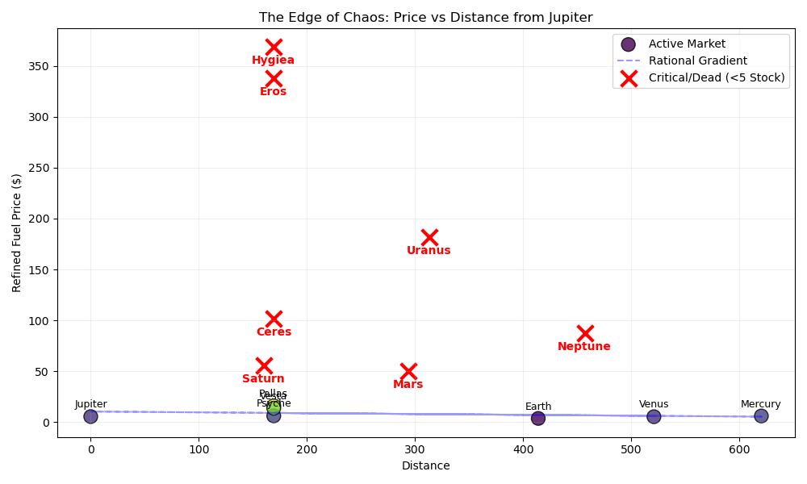
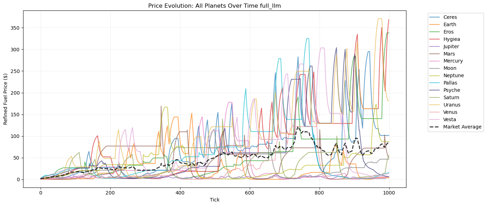
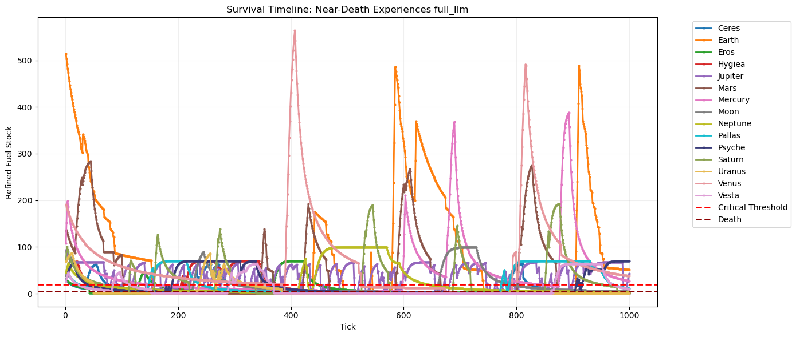
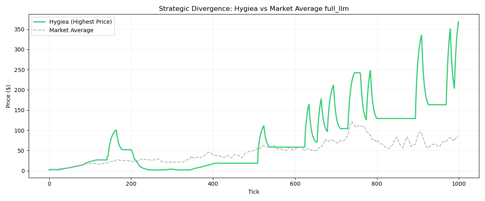

# 🔭 Constellation Analysis Report full_llm
**Run ID:** [20251224_104039](https://youtu.be/LScOdcZ-MEE)

## 1. Macro Health
- **Mortality Rate:** 46.7% (7/15 Dead)
- **Gini Coefficient (Planet Wealth):** -0.308
- **Total System Wealth:** $5,862
  - Agent Wealth: $351,894
  - Planet Wealth: $-346,033

### The Edge of Chaos

## 2. Strategic Performance

| Planet | Type | Strategy | Stock | Wealth | Alpha |
| :--- | :--- | :--- | :--- | :--- | :--- |
| **Jupiter** ✅ | ai | `dynamic` | 42.5 | $2,767 | **+112.0%** |
| **Ceres** ❌ | ai | `discount` | 0.8 | $-3,071 | **+86.7%** |
| **Earth** ✅ | ai | `dynamic` | 51.3 | $-11,723 | **+49.2%** |
| **Eros** ❌ | ai | `emergency` | 1.2 | $-19,279 | **+16.4%** |
| **Neptune** ❌ | ai | `dynamic` | 3.4 | $-19,630 | **+14.9%** |
| **Uranus** ❌ | ai | `premium` | 0.7 | $-20,136 | **+12.7%** |
| **Hygiea** ❌ | ai | `emergency` | 1.1 | $-21,641 | **+6.2%** |
| **Psyche** ✅ | ai | `premium` | 69.7 | $-22,271 | +3.5% |
| **Pallas** ⚠️ | ai | `dynamic` | 10.9 | $-22,939 | +0.6% |
| **Venus** ✅ | ai | `premium` | 37.9 | $-24,954 | -8.2% |
| **Vesta** ⚠️ | ai | `dynamic` | 10.0 | $-25,825 | -11.9% |
| **Moon** ⚠️ | ai | `dynamic` | 5.1 | $-28,496 | -23.5% |
| **Mars** ❌ | ai | `dynamic` | 1.0 | $-36,085 | -56.4% |
| **Mercury** ✅ | ai | `dynamic` | 27.2 | $-40,171 | -74.1% |
| **Saturn** ❌ | ai | `dynamic` | 1.0 | $-52,579 | -127.9% |

## 3. Key Findings

### 1. Jupiter Supply Volatility

**Stockout Events:** 48 (distinct crises)

**Minimum Stock:** 1.0 units

**Time Critical:** 11.4% of simulation

**Final Stock:** 42.5 units

### 2. Neptune Supply Volatility

**Stockout Events:** 7 (distinct crises)

**Minimum Stock:** 1.0 units

**Time Critical:** 28.1% of simulation

**Final Stock:** 3.4 units

### 3. Saturn Supply Volatility

**Stockout Events:** 7 (distinct crises)

**Minimum Stock:** 0.9 units

**Time Critical:** 58.0% of simulation

**Final Stock:** 1.0 units

### 4. Hygiea Price Volatility

**Peak Price:** $368.61

**Average Price:** $82.76

**Std Deviation:** $92.35

**Coefficient of Variation:** 111.6%

### 5. Planet Deaths

**Deaths:** 7/15 planets

**Mortality Rate:** 46.7%

**Dead Planets:** Ceres, Eros, Neptune, Uranus, Hygiea, Mars, Saturn

## 4. System Dynamics

### Price Evolution

### Survival Timeline

### Strategy Divergence

## 5. Cognitive Audit

### 🪐 JUPITER
- **[Tick 955]** `nan`: _Given that we are a significant producer of fuel_raw, it's best to keep the price fixed at $0.02 to ensure a steady supply and attract traders. For food and fuel_refined, which are critical for survival but consumed in small amounts, dynamic pricing is used to respond to market demand and maintain stock levels._
- **[Tick 975]** `nan`: _Maintaining a fixed price for fuel_raw ensures a stable and low-cost supply to the market, encouraging trade volume. Dynamic pricing is used for food and fuel_refined to attract traders based on real-time demand and inventory levels._
- **[Tick 990]** `nan`: _I am a net producer of fuel_raw and need to keep prices low for other planets. I am using 'fixed' pricing for fuel_raw at $0.02 to ensure consistent supply to traders. For critical assets like food and fuel_refined, I am using dynamic pricing to attract traders based on market demand. The refinery is set to normal priority to balance production of refined fuel with raw fuel sales._

### 🪐 CERES
- **[Tick 970]** `nan`: _Given the critical shortage of fuel_refined, I am using 'discount' pricing to attract traders and quickly build up inventory. Food production exceeds consumption, allowing for fixed pricing without risk of stock depletion. The refinery is set to aggressive mode to convert raw materials into refined fuel as fast as possible._
- **[Tick 985]** `nan`: _Given the critical low stock of fuel_refined, I'm using a discount strategy to attract traders and increase sales volume. Food production exceeds consumption, so I'm setting it to fixed pricing for stable revenue generation. The refinery is set to aggressive mode to maximize refined fuel production from any incoming raw fuel._
- **[Tick 995]** `nan`: _Dynamic pricing for fuel_refined to attract traders and prevent stockouts. Fixed pricing for food at a slight premium since it's not critical but profitable. Aggressive refinery operation due to low raw fuel inventory._

### 🪐 EARTH
- **[Tick 960]** `nan`: _Given the current low stock of fuel_refined (11 ticks), we are using a 'premium' pricing strategy to attract traders while keeping food prices fixed at $1.50 as it is in surplus. Refinery priority set to normal since fuel_raw inventory is depleted and production of refined fuel is critical._
- **[Tick 975]** `nan`: _Set 'dynamic' pricing for fuel_refined due to critical consumption needs and low stock. Use fixed pricing for food as it is a stable producer asset with high inventory. Set refinery priority to normal to balance between production and sales of raw fuel._
- **[Tick 985]** `nan`: _Given the current inventory status, with fuel_refined at critically low levels (~10 ticks), dynamic pricing is essential to attract traders and replenish stock. Food production exceeds consumption, allowing for fixed pricing to maximize profit margins. The refinery is set to normal priority as aggressive refining would deplete raw materials without ensuring delivery of refined fuel._

### 🪐 EROS
- **[Tick 960]** `nan`: _Given the critical status of both food and fuel refined, dynamic pricing is essential to attract traders for these scarce resources. Premium pricing on fuel_refined ensures that any trader willing to travel will be rewarded with high margins, making the journey worthwhile despite isolation._
- **[Tick 980]** `nan`: _Given the critical status of both food and fuel_refined, I am using an 'emergency' strategy for fuel_refined to ensure immediate supply. Food is priced at a premium to attract traders when necessary while maintaining high margins._
- **[Tick 995]** `nan`: _Given the critical low stock levels of both food and fuel_refined, an emergency pricing strategy is necessary to attract traders immediately. Premium prices for food ensure that it remains a high-value trade item while also attracting traders with higher profits. Fuel_refined needs immediate attention due to its essential nature, so setting emergency prices will incentivize traders to bring in more refined fuel despite the long travel distance._

### 🪐 NEPTUNE
- **[Tick 964]** `nan`: _The outpost is critically low on refined fuel, which requires immediate attention. Dynamic pricing for food ensures that it remains attractive to traders but does not overprice it. Premium pricing for refined fuel will attract traders willing to pay a premium price to restock this critical resource._
- **[Tick 984]** `nan`: _Given the critical low stock of fuel_refined and the need to attract traders, I am using a dynamic pricing strategy for food to ensure stable supply. For fuel_refined, I'm employing a premium pricing strategy to maximize profit due to its essential nature and remote location. The refinery is set to aggressive priority to quickly build up refined fuel inventory._
- **[Tick 999]** `nan`: _Given the low stock of fuel_refined and critical consumption rate, switching to a premium pricing strategy will ensure traders see the high profit margins necessary to make the journey worthwhile. Food inventory is sufficient for now but should be monitored closely._

### 🪐 URANUS
- **[Tick 955]** `nan`: _Given the critical low stock levels of both food and fuel_refined, I am setting emergency pricing on fuel_refined to attract immediate traders. Food is also in short supply but not as urgent for refinery output since it's organic and doesn't rely on refining. Aggressive refinery operations will maximize refined fuel production while dynamic pricing on food ensures a balance between attracting traders and maintaining profitability._
- **[Tick 970]** `nan`: _Given the critical stock levels for both food and refined fuel, I am setting emergency pricing to attract traders immediately. The refinery is set to aggressive mode to maximize production of refined fuel since raw fuel isn't being produced locally. Both assets are prioritized as critical due to low inventory._
- **[Tick 980]** `nan`: _Given the critical shortage of both food and fuel_refined, a dynamic pricing strategy is necessary to attract traders. Premium prices for fuel_refined will ensure that it's worth the journey for traders given its importance. Aggressive refinery priority ensures we maximize refined fuel production from any raw fuel that arrives._

### 🪐 HYGIEA
- **[Tick 970]** `nan`: _Given the critical low stock of fuel_refined and active consumption, emergency pricing is essential to attract traders quickly. Food has stable demand but higher margins can be maintained with premium pricing._
- **[Tick 980]** `nan`: _Given the critical stock status of fuel_refined and low trading activity, I am employing a 'premium' pricing strategy for fuel_refined to attract traders willing to pay higher prices due to its essential nature. Food is set to dynamic pricing to naturally adjust based on inventory levels while attracting necessary trade._
- **[Tick 990]** `nan`: _Fuel refined is critically low, so emergency pricing is needed to attract traders immediately. Food is important for survival but not as critical as fuel refined, hence premium pricing to maintain high margins while ensuring supply._

### 🪐 PSYCHE
- **[Tick 955]** `nan`: _Given the remote location and critical consumption of fuel_refined and food, I am using a dynamic pricing strategy for food to maintain balance with supply. For fuel_refined, which is essential for survival but also a high-value trade good due to distance from primary sources, I'm employing a premium pricing strategy to maximize margins while ensuring traders find it worthwhile to travel here. The refinery is set to aggressive priority to ensure maximum refined fuel production._
- **[Tick 975]** `nan`: _Given the remote nature of this outpost, critical assets like food and refined fuel need to be priced to attract traders while maintaining high margins. Dynamic pricing for food ensures it remains attractive without excessive markdowns. Premium pricing for refined fuel leverages its essential role in survival to maximize profit margins. Aggressive refinery priority maximizes production due to high consumption needs._
- **[Tick 995]** `nan`: _Given the remote location and low trading activity, I am using a dynamic pricing strategy for critical assets like food to ensure stock levels remain stable. For fuel_refined, which is essential for survival but also highly profitable due to its importance in long-distance travel, I am employing a premium pricing strategy to maximize margins while still attracting necessary traders._

### 🪐 PALLAS
- **[Tick 930]** `nan`: _Given the planet's remote location and critical consumption needs, dynamic pricing is essential to attract traders. Food and fuel_refined are prioritized as critical for survival, so their prices will adjust based on stock levels. The refinery operates at a normal priority to balance refined fuel production with raw fuel sales._
- **[Tick 950]** `nan`: _Given the remote location and low trading activity, I am employing a dynamic pricing strategy for food to attract traders while maintaining a premium price for fuel_refined to ensure high margins. The refinery is set to aggressive mode to maximize refined fuel production due to high consumption rates._
- **[Tick 980]** `nan`: _Given the remote location and critical need for fuel_refined, a premium pricing strategy is used to ensure traders are incentivized to travel long distances. Food is also set to dynamic pricing to balance inventory levels while attracting necessary trade._

### 🪐 VENUS
- **[Tick 974]** `nan`: _Given the low stock levels of food and fuel refined, dynamic pricing is essential to attract traders. Emergency pricing for food ensures immediate delivery, while premium pricing for fuel refined balances attracting traders with higher margins due to high consumption._
- **[Tick 984]** `nan`: _Dynamic pricing for fuel_refined to ensure steady supply, with a premium markup to attract traders. Emergency strategy for food due to critically low stock levels._
- **[Tick 994]** `nan`: _Given the current low stock levels for food and fuel_refined, I am using dynamic pricing with an emergency strategy for food to attract immediate traders. For fuel_refined, I am using a premium strategy to maintain high prices while still being responsive to stock levels. The refinery is set to aggressive priority to maximize refined fuel production. Reviewing the strategy every 10 ticks due to critical asset shortages._

### 🪐 VESTA
- **[Tick 945]** `nan`: _Given the remote location, high travel costs for traders, and critical consumption of fuel_refined and food, dynamic pricing is essential to attract necessary trades. Premium prices for refined fuel ensure it remains a valuable asset worth trading despite the distance. Aggressive refinery priority maximizes production to maintain inventory stability._
- **[Tick 965]** `nan`: _Given the remote location and high fuel costs for traders, I am using a dynamic pricing strategy to ensure that critical assets like food attract necessary trade activity. For fuel_refined, which is essential but not in short supply at this moment, I am applying a premium markup to maintain higher margins given the long travel distances._
- **[Tick 985]** `nan`: _Dynamic pricing is used for both food and fuel refined to ensure stock levels are maintained by attracting traders when necessary. Refinery set to normal priority since there's no immediate need to maximize production as current stocks are sufficient._

### 🪐 MOON
- **[Tick 950]** `nan`: _Given the low stock of fuel_refined and critical consumption rates, a dynamic pricing strategy is essential to attract traders. Both food and fuel_refined are survival-critical assets, requiring aggressive refinery operations to maximize production while ensuring high prices to cover travel costs for traders._
- **[Tick 965]** `nan`: _Given the critical status of fuel_refined and low stock levels, I am setting a premium price to attract traders. Food is also important for survival but has sufficient stock, so dynamic pricing will be used. Refinery priority is set to normal as there is no raw fuel available yet._
- **[Tick 985]** `nan`: _Given the critical status of fuel_refined and low inventory, I set its pricing to premium to attract traders. Food is less urgent but still important, so dynamic pricing will adjust as needed._

### 🪐 MARS
- **[Tick 962]** `nan`: _Given the critical low stock of fuel_refined and food, I am employing an emergency pricing strategy for fuel_refined to prioritize attracting traders immediately. The dynamic pricing for food ensures adaptability based on inventory levels while maintaining critical supplies. Refinery is set to aggressive mode to maximize refined fuel production._
- **[Tick 977]** `nan`: _Given the critical status of fuel_refined and food, I am using emergency pricing for fuel_refined to attract immediate traders. Dynamic pricing is used for food to balance supply and demand while ensuring critical stock levels are maintained. The refinery is set to aggressive mode to rapidly increase refined fuel production._
- **[Tick 987]** `nan`: _Given the critical low stock of both food and fuel_refined, I am using dynamic pricing to attract traders and keep inventory levels up. The refinery is set to aggressive mode to quickly convert any incoming raw fuel into refined fuel to prevent a stockout crisis. Review strategy soon due to the urgency._

### 🪐 MERCURY
- **[Tick 925]** `nan`: _Given the remote location and low trading activity, dynamic pricing for food will ensure a steady supply while maintaining high margins on fuel_refined to attract traders willing to make the journey. Aggressive refinery operations are essential to maximize fuel production._
- **[Tick 950]** `nan`: _Given the remote outpost status, I've set a dynamic pricing strategy to attract traders for critical and important assets like food and refined fuel. The premium pricing on fuel_refined ensures that it's worth the travel distance for traders while maintaining high margins due to its essential nature._
- **[Tick 980]** `nan`: _Given the remote nature of the outpost and the high consumption rates for essential goods like food and refined fuel, a 'dynamic' pricing strategy is necessary to attract traders. Raising prices when stock levels are low will ensure that critical supplies do not run out. The refinery should be set to 'aggressive' mode to maximize production of refined fuel since we consume more than produce it._

### 🪐 SATURN
- **[Tick 945]** `nan`: _Given the current inventory and consumption rates, I am using a dynamic pricing strategy for both food and fuel_refined to ensure stock levels are maintained while attracting traders. The refinery is set to normal priority to balance production with sales opportunities. Reviewing strategy in 20 ticks to adapt to changing conditions._
- **[Tick 965]** `nan`: _Using 'dynamic' pricing for food and 'discount' for fuel_refined to attract traders and ensure stock stability. Setting refinery priority to aggressive as the current stock of refined fuel is low. Review in 25 ticks or immediately if emergency triggers are met._
- **[Tick 990]** `nan`: _Given the critical state of fuel_refined and food, I've set dynamic pricing for both to adapt based on stock levels. Fuel_refined is at an emergency level, so it's priced with 'emergency' strategy to attract immediate refueling trades. The refinery is set to aggressive mode to rapidly increase refined fuel production from any incoming raw fuel._

